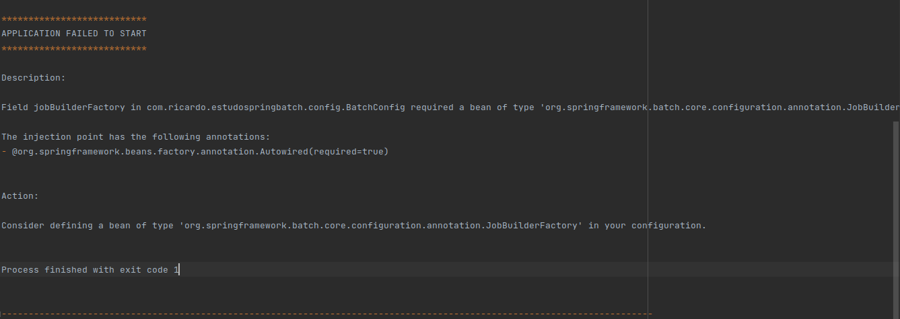

# spring-batch

Um sistema que realiza um processamento de uma quantidade finita de dados sem interação ou interrupção.

Uma das grandes dificuldades é o processamento desse grande lote de dados, algumas questões que devem ser endereçadas são:

# Tempo
- Quanto tempo um processamento que precisa ser realizado sem prejuizo dos sistemas que precisam desses dados

# Integridade
- se um processamento falhar como garantir a integridade dos dados

# Execução
- Como o sistema irá executar de forma agendada

# Monitoramento

- Como acompanhar a execução do processamento

# Escabilidade
- É crucial para garantir que o processamento de dados seja feito dentro da janela de tempo definida para a execução
---------------------------------------------------------------------------------------------------------------------------------
# PROBLEMAS ENCONTRADOS DURANTE O DESENVOLVIMENTO

- Quando usamos o spring batch, precisamos usar algum datasource, porque o spring batch ele salva metadados que são importantes para o bom funcionamento dele
- vamos utilizar um banco em mémoria H2.

# @EnableBatchProcessing

- Anotamos na classe config para que ela traga todo o contexto do framework evitando o seguinte erro :

 

-------------------------------------------------------------------------------------------------------------------------

# BatchConfig

- Para que eu consiga informar que existe uma rotina batch, vamos usar o Job(tarefa) e encapuslar elas